<h1 align="center">All Colors (allc)</h1>

<p align="center">A fast TypeScript package for color management.</p>

## Installation

```shell
bun i allc
```

...or use your favourite package manager.

## Spaces and Models

(All colors have the standard illuminant D65.)

* CIE 1931 XYZ
* CIE 1931 xyY
* RGB / HSL / HSV / HSI
    * sRGB
    * Display P3
    * AdobeRGB
* LAB / LCH
    * Ok
    * CIE

## Guarantees (!)

* **This package does not allocate!** Yes, you heard that right. Conversions do not allocate any objects. The only
  things
  which can be allocated are instances of the color class, which the user does. This is why allc is so fast.
* **This package does not throw.** In fact, it does not even error in any way.
* **This package is side-effect-free.**
* **This package is tree-shakable.** The `Color` class is a convenience, you can use the raw conversion functions.
* **This package is (runtime) dependency-free.** There are still some dev-dependencies used in the compilation (e.g.,
  TypeScript).

## General Structure / Overview

TL;DR, allc provides a vast set of primitive color conversion functions, named `to{TARGET}From{SOURCE}(...)`.
They are a bit low-level, but you can use them if you like more control over color conversion.

Additionally, allc provides a `Color` class. This is a big object representing some color whose properties
you can access.

* Properties are **lazily calculated** from others and **cached** on the object.
* `Color` objects are **immutable**, meaning they play well with UI frameworks like React or SolidJS. To change the
  color, create a new one.
* Property calculation on `Color` prefers the most accurate path.

This is it. allc does not have more features.

## Planned Features

* ProPhoto support
* Rec. 2020 support
* Rec. 2100 support
* HWB color model support
* D50 support

If you would like to implement one of these features, feel free to submit a PR :)

## License

This repository is MIT-licensed. You can find a copy of the license [here](./LICENSE).