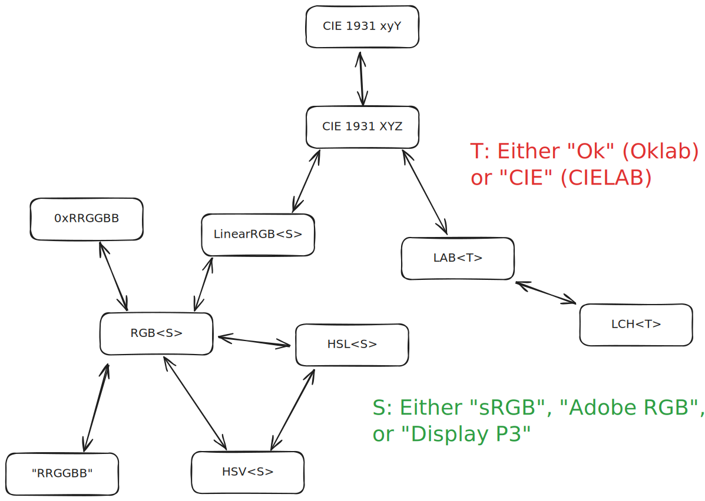

<h1 align="center">All Colors (allc)</h1>

<p align="center">A small TypeScript package for color management.</p>

## Installation

```shell
bun i allc
```

...or use your favourite package manager.

## Spaces, Models, and Conversions

(All colors have the standard illuminant D65.)



## Guarantees

- This package does not throw.
- This package is side-effect-free (only pay for what you use).

## Planned Features

* ProPhoto support
* Rec. 2020 support
* Rec. 2100 support
* HSI color model support
* HWB color model support
* D50 support

If you would like to implement one of these features, feel free to submit a PR :)

## License

This repository is MIT-licensed. You can find a copy of the license [here](./LICENSE).